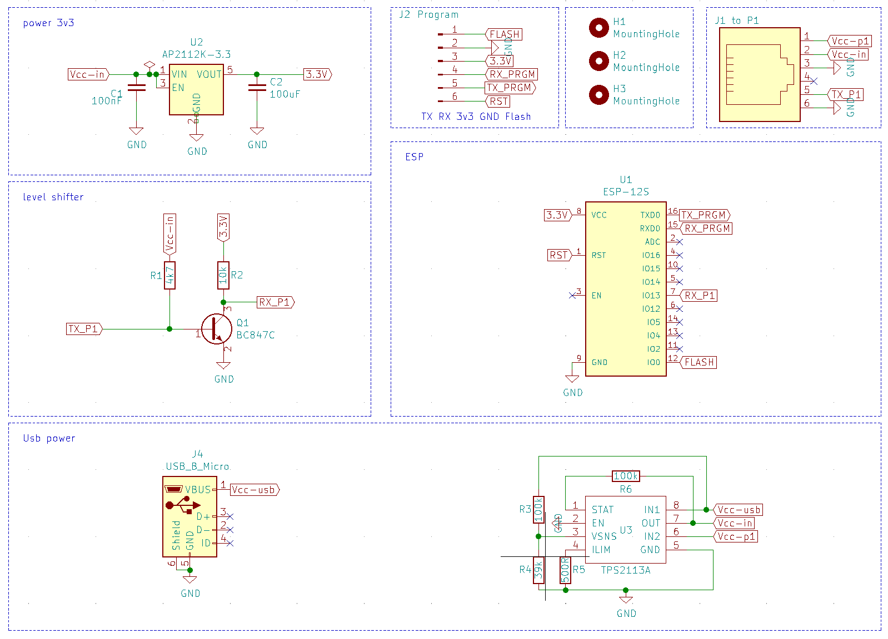
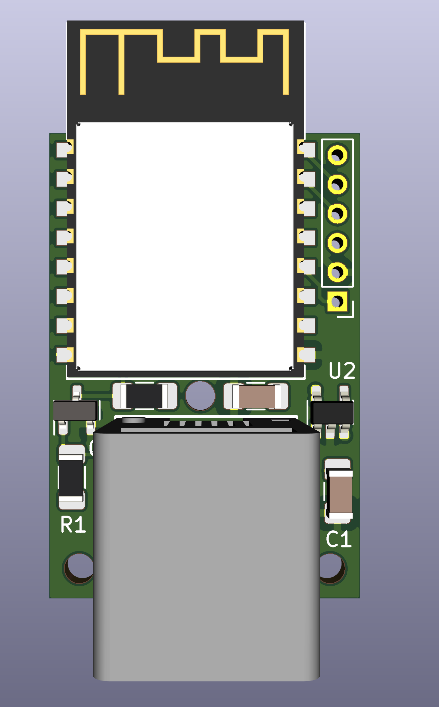
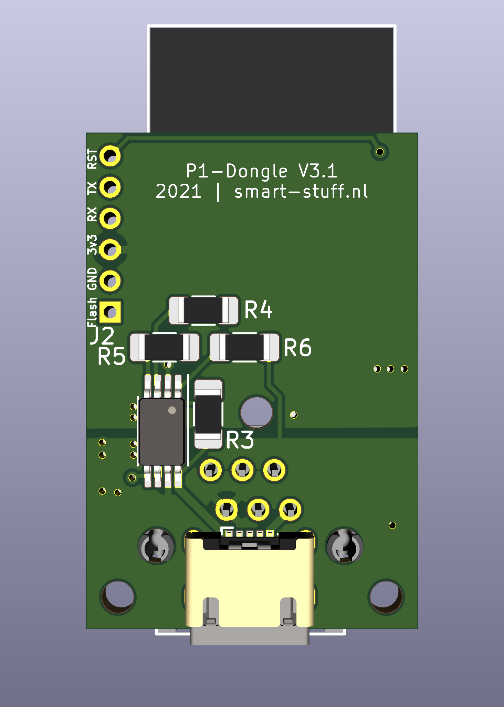
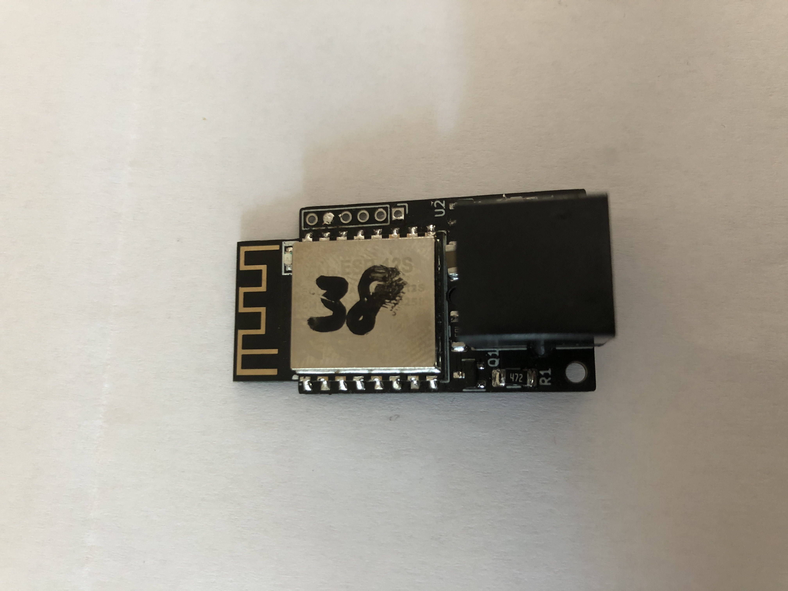

# Slimmemeter P1 Dongel - DSMR-API - Hardware versie 3.1
Eigenschappen
- ESP-12S (4MB) als CPU Soc -> veel pull-up weerstanden zijn al aanwezig waardoor het aantal extra componenten laag kan blijven
- gebruikt secundaire seriale interface (UART1)
- P1 signaal inversie via transistor, 1 weerstand minder dan V3 werkt ook prima; Software serial is niet betrouwbaar genoeg
- RJ11 socket voor gemakkelijke aansluiting
- usb micro connector voor externe voeding. Sommige DSMR 5.x en de DSMR 4.x leveren te weinig vermogen
- Power MUX om automatisch van voedingsbron te wisselen. USB is primair.
- Primaire componenten op bovenkant van de pcb zodat deze in oven/hotplate gemaakt kan worden
- Secundaire componenten (MUX/usb) zitten op de onderkant
- 6 pin aansluiting aan de zijkant voor eenvoudige flashing
- nieuwe spanningsregelaar met een nog lagere spanningsval, meer stroom aan kan. Resultaat minder warmte afgifte en hogere betrouwbaarheid
- GEEN optocoupler meer ... DTR signaal is altijd hoog. Werkt prima ... echter met iets meer errors. In de praktijk minder dan 0,1% errors = acceptabel
- Gaatjes in het boardje om deze makkelijk in een 3D printed case te kunnen monteren (work in progress als opensource ook beschikbaar)

## SCHEMA
Op het printje zitten de volgende modules:
- signaal inverter om het P1 signaal te inverteren (level shifter)
- spanningsregulator voor het naar 3.3Volt brengen van de P1 spanning.
- ESP-12S CPU SoC
- Power Mux

Alle modules samen zie je in het onderstaande schema.
 

Omgezet naar een pcb ziet dit er zo uit:
Bovenkant             |  Onderkant |  Eindresultaat
:-------------------------:|:-------------------------:|:-------------------------:
  |   | 

Afmeting van de print is 31.8 mm * 21.3 mm

## SOFTWARE
Op basis van de DSMR API software van Willem aandeWiel is eerder al een doorvertaling gemaakt naar specifieke code voor de V2 en V3 hardware. Voor de V3.1 versie zijn er wederom aanpassingen gedaan met name vanwege het ontbreken van het DTR signaal. De code is hiervoor geoptimaliseerd.
Naar behoefte zou ook Tasmota of andere firmware gebruikt kunnen worden, dit is op de V3.1 versie verder niet uitgeprobeerd.

Aanpassing (tot nu toe) ten opzichte van DSMR-API van Willem zijn:
- alle statische pagina's komen uit een CDN (esp modules hebben maar een beperkte capaciteit en zijn geen hele goede webservers;)
- alle plaatjes zijn  iconen geworden en komen van een cdn
- files zijn omgezet naar Json zodat dit makkelijk te onderhouden en compacter is
- json API communicatie is ook gewijzigd (compacter en als een burst ipv gesegmenteerd)
- opmaak is zo veel als mogelijk uit de html / js files gehaald en in de css gestopt
- nieuw dashboard gemaakt
- Front-end settings worden van de dongel gelezen (een eerste aanzet)
- LittleFS in plaats van SPIFFS als bestandssysteem

Instructie is te vinden in de [setup/dsmr-api](setup/dsmr-api/README.md) folder.

# Hardware maken of aanschaffen
Je kan je eigen hardware maken of deze aanschaffen. Wil je deze aanschaffen dan kan je mij altijd een DM sturen. De oplossing is ook Plug-and-play te koop inclusief firmware.