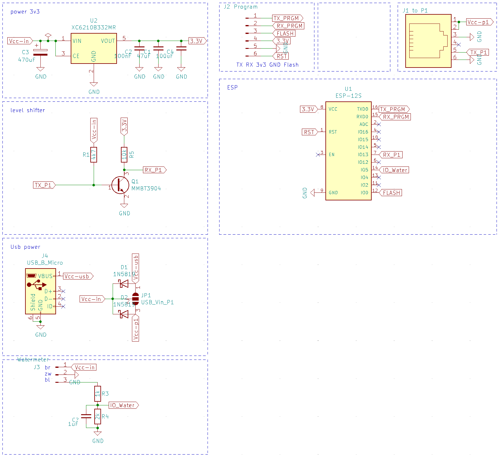
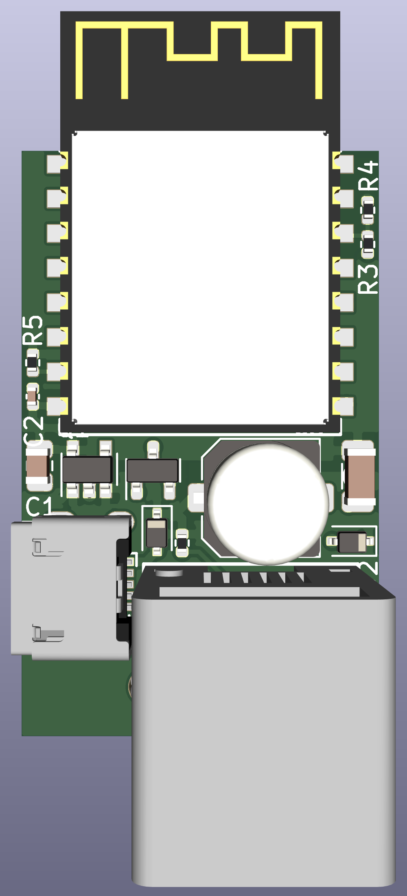
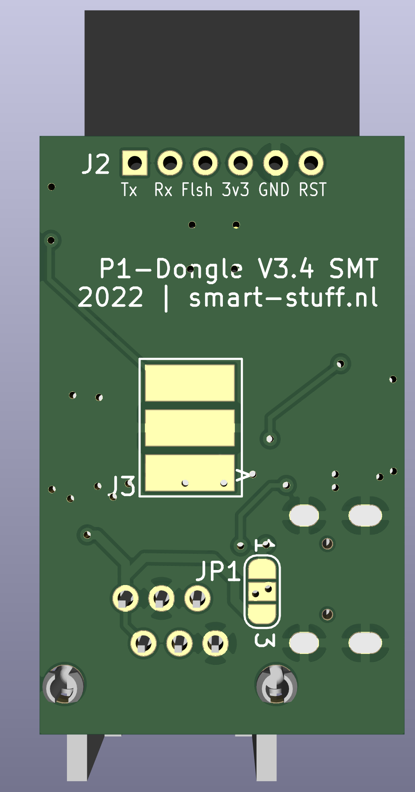

</a>&nbsp;

# NEW

Nu ook native ESPHome - Home Assistant integratie.
Inclusief hardware serial ondersteuning.

Er zijn hiermee meerdere keuzes mogelijk met deze hardware, namelijk:
1. DSMR-API software: met eigen opslag en web interface. ook via mqtt te koppelen met Home Assistant of andere smart home oplossingen Zie [manual/dsmr-api](manual/dsmr-api/README.md)
2. ESPHome: voor naadloze integratie met Home Assistant. Zie [manual/epshome](manual/esphome/README.md)
3. Tasmota: in ontwikkeling Zie [manual/tasmota](manual/tasmota/README.md)

# Slimmemeter P1 Dongel - versie 3.7
Eigenschappen
- hardware design voor ESPhome + DSMR API
- gebruikt secundaire seriale hardware interface (UART1) voor de beste performance
- ESP-12F (4MB) als CPU Soc
- P1 signaal inversie via BJT transistor
- 6P6C (RJ12) socket voor gemakkelijke aansluiting
- usb micro connector voor externe voeding bij SMR 4.x/3.x/2.x meters en soms bij 5.x meters
- 2 diodes voor de USB/P1 return power beveiliging
- Primaire componenten op bovenkant van de pcb makkelijk voor de smt
-  LDO met een extreem laag verlies. Resultaat minder warmteafgifte en hogere betrouwbaarheid
- DTR signaal is altijd hoog
- optie om er een watermeter dongle van te maken
- optie om er een s0 dongle (pulsteller) van te maken

## SCHEMA
Op het printje zitten de volgende modules:
- voedingscircuit: een ultra low LDO spanningsregelaar zorgt er voor dat de 5Volt naar 3.3 omgezet wordt. 
- Dikke condensator voor het opvangen van de stroompieken tijden Wifi startup
- CPU: - ESP-12F 4Mb
- level shifter: om het P1 signaal te inverteren
- USB Power: om de p1 te kunnen voeden als paracitaire voeding (uit de p1) niet kan. Bijvoorbeeld bij SMR 2/3/4 meters of sommige 5.0 meters die heel gevoelig afgesteld zijn
- watermeter: klein circuit om watermeter sensor op aan te kunnen sluiten. Dit is een spanningsdeler. In de 3.5 versie komt hier een opto coupler voor in de plaats
- J2: om de dongle te kunnen programmeren
- J1: om de dongle aan te sluiten op de p1 poort van de slimme meter

Alle modules samen zie je in het onderstaande schema.
 

Omgezet naar een pcb ziet dit er zo uit:

Bovenkant             |  Onderkant 
:-------------------------:|:-------------------------:
 |   

Afmeting van de print is 33 mm * 20 mm

## DSMR API SOFTWARE
Op basis van de DSMR API software van Willem aandeWiel is eerder al een doorvertaling gemaakt naar specifieke code voor de V2 en V3 hardware. Voor de V3.3 versie zijn er wederom aanpassingen gedaan met name vanwege het ontbreken van het DTR signaal. De code is hiervoor geoptimaliseerd.
Naar behoefte zou ook Tasmota of andere firmware gebruikt kunnen worden, dit is op de V3.3 versie verder niet uitgeprobeerd.

Aanpassing (tot nu toe) ten opzichte van DSMR-API van Willem zijn:
- alle statische pagina's komen uit een CDN (esp modules hebben maar een beperkte capaciteit en zijn geen hele goede webservers;)
- alle plaatjes zijn  iconen geworden en komen van een cdn
- files zijn omgezet naar Json zodat dit makkelijk te onderhouden en compacter is
- json API communicatie is ook gewijzigd (compacter en als een burst ipv gesegmenteerd)
- opmaak is zo veel als mogelijk uit de html / js files gehaald en in de css gestopt
- nieuw dashboard gemaakt
- Front-end settings worden van de dongel gelezen (een eerste aanzet)
- LittleFS in plaats van SPIFFS als bestandssysteem
- Home Assistant MQTT auto discovery 
- Watermeter uitbreiding

Uitgebreide documentatie is te vinden op: [Gitbook](https://docs.smart-stuff.nl/v/p1-dongle-api/)

## ESPHome SOFTWARE
Een hele eenvoudige manier om de dongle te koppelen aan Home Assistant is door middel van de ESPHome firmware + dsmr configuratie.
Belangrijkste voordeel is dan direct na het koppelen aan uw Wifi-netwerk begonnen kan worden met het toevoegen van de dongle in Home Assistant.

Hoe dit werkt en waar de yaml te vinden is kunt u hier lezen: [manual/esphome](manual/esphome/README.md)

# Hardware maken of aanschaffen
Je kan je eigen hardware maken of deze aanschaffen. Wil je deze aanschaffen neem dan een kijkje op <a href="https://smart-stuff.nl/shop/" target="_blank">smart-stuff.nl</a>