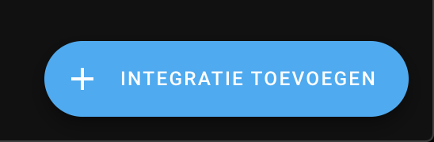

# Home Assistant integratie

> LET OP! voor deze integratie dient een MQTT broker aanwezig te zijn in uw netwerk of in Home Assistant

HA maakt gebruik van de MQTT koppeling om de data vanuit de P1 dongel te ontvangen.
Om een koppeling te maken met HA dienen de volgende stappen doorlopen te worden.

>**HOME ASSISTANT AUTO DISCOVERY</br>**
> Vanaf firmware 3.2.2 is stap 1 & 2 niet meer nodig. De sensors worden automatisch door HA herkend.

1. Pas de configuration.yaml aan met extra sensors
2. Toevoegen van sensors.yaml
3. Voeg de MQTT integratie toe zodra deze niet bestaat
4. Naar behoefte dashboard + energie tabbladen configureren

**1. aanpassen configuration.yaml**</br>
Neem onderstaande code op in de `configuratie.yaml`

```
sensor: !include sensors.yaml
```


**2. Toevoegen van sensors.yaml**</br>
Voeg de `sensors.yaml` file in deze folder toe aan de HA configuratie waar ook de `configuratie.yaml` staat.

**3. Voeg de MQTT integratie toe zodra deze niet bestaat**</br>
Ga in HA naar Instellingen > Apparaten & Diensten en volg onderstaande stappen zodra MQTT integratie niet bestaat.</br>
Toevoegen MQTT integratie</br>
<br>
Zoek op mqtt</br>
<br>
Toevoegen broker naam/adres (192.168.2.250 is een voorbeeld)</br>
<br>
<br>

**4. Naar behoefte dashboard + energie tabbladen configureren**</br>
Stel de verschillende tegels zelf samen en configureer de Energie tab op basis van de nieuwe entiteiten.</br>
<br>


**Veel plezier met de dongle!**