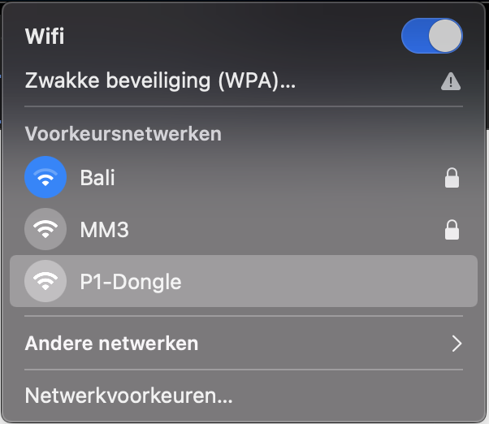
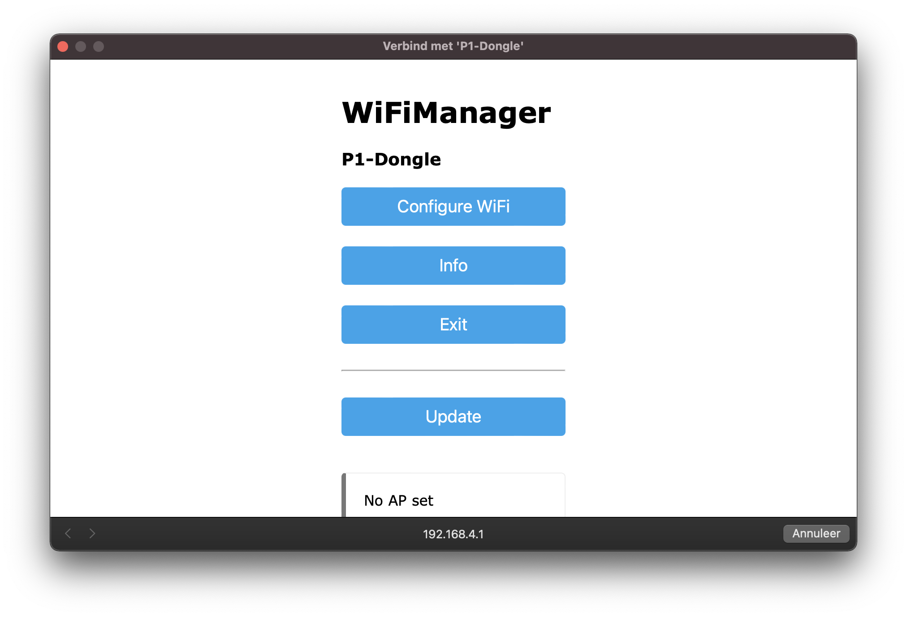
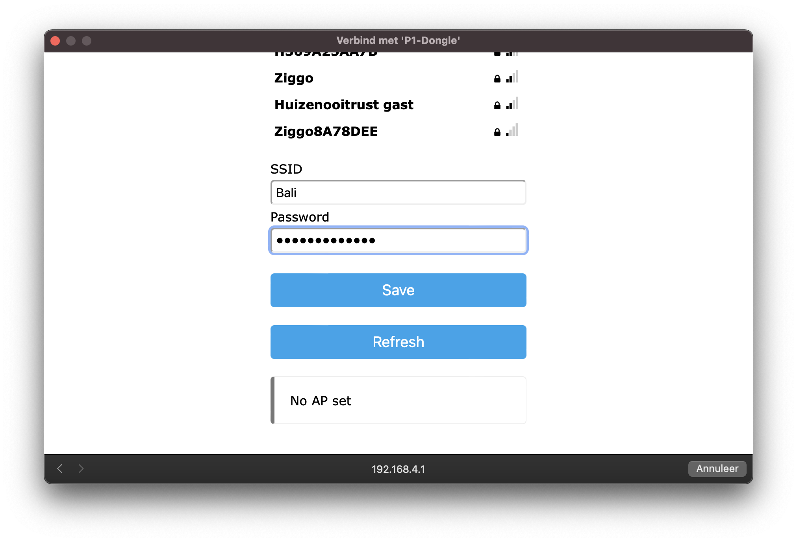
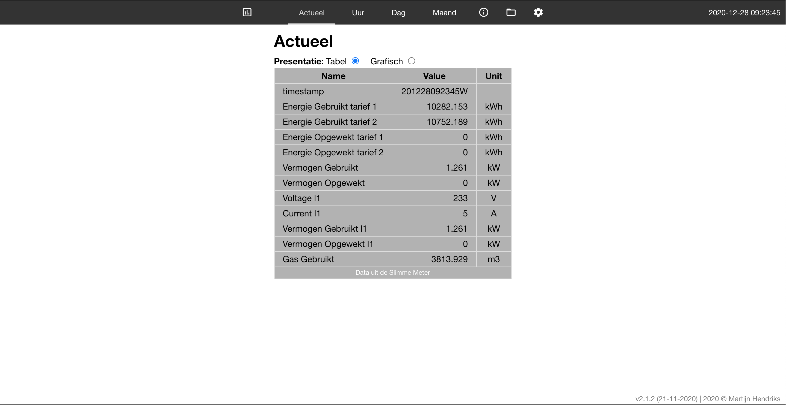

# **Slimmemeter P1 Dongel**

Dit document beschrijft de installatie en configuratie van de P1 Dongel op hardware versie 3.x. De hardware komt met werkende software. Wil je deze aanpassen ga dan naar het onderdeel software.

>Dit project is een doorontwikkeling op basis van het pionierswerk van Willem Aandewiel. Inmiddels is deze initiële software op diverse punten gewijzigd en zijn nieuwe mogelijkheden toegevoegd.
>Meer informatie over de DSMR API van Willem: [https://mrwheel-docs.gitbook.io/dsmrloggerapi/](https://mrwheel-docs.gitbook.io/dsmrloggerapi/)

## **LED functie (indien uw dongle met led uitgerust is)**<br>
De laatste dongels zijn uitgerust met een blauwe LED. Deze heeft meerdere functies, namelijk:
- na inpluggen zal de LED 1.5 seconde oplichten. Is dit niet het geval dan is er een probleem met stroom of met de dongel
- Zodra de dongel WiFi connectie heeft zal de LED blijven branden.
- Tijdens het lezen van een Telegram zal de LED kortstondig uit of aan gaan. Indien er Wifi verbinding is gaat de LED kort uit. Indien er geen Wifi is zal de LED kort aan gaan.


## **USB voeding**<br>
Heeft de dongel een usb voeding en de slimme meter is van een ouder type dan SMR 5.0 of de slimme meter is te kritisch om de dongel te voeden dan dient de usb aansluiting van de dongel via een usb kabel met een usb adapter verbonden te worden.
De USB adapter mag een oude smartphone of tablet adapter zijn of een usb aansluiting die voorhanden is in de meterkast (bv van een NAS/Router). Bijna alle voedingen voldoen (5V/5Watt is prima).

## **Configuratie Wifi**<br>
Na het aansluiten van de dongel op je P1 ingang van je slimme meter bouwt de dongel als eerste een eigen Wifi hotspot op ten behoeve van configuratie. Deze hotspot is te herkennen door de Wifi-naam **P1-Dongle**.

Zorg dat je met je computer of mobieldevice contact maakt met dit netwerk. Automatisch wordt een updatescherm getoond waarin de Wifi settings te zien zijn. Zie onderstaande voorbeeld op MacOS.



Zorg dat je met je computer of mobiel toestel contact maakt met dit netwerk, door hier op te klikken. Automatisch wordt een scherm getoond waarin de WifiManager te zien is. Zie onderstaande plaatje.




1. Klik op &quot;Configuratie Wifi&quot;



1. Klik op het uw netwerknaam en vul daarna het bijbehorende en **wachtwoord** in bij Password.
2. Druk op &quot;Save&quot;
3. Adapter zal op nieuwe opstarten en u kunt het scherm sluiten.

Vanaf dit moment zal de adapter te vinden zijn via:<br>
[http://dsmr-api.local/](http://dsmr-api.local/) 

De P1 dongle Pro (ESP32) gebruikt andere url's, namelijk:<br>
[http://p1-dongle-pro.local/](http://p1-dongle-pro.local/) voor de laatste versies en<br>
[http://p1-dongle.local/](http://p1-dongle.local/)  voor de oudere versies<br>

Deze hostnaam is aanpasbaar (via configuratie).
<br>

## **Dongle niet te bereiken via url**
>Mocht de dongle niet gevonden kunnen worden via de url dan kan het zijn dat de hostname niet door de router heen komt. Dan kunt u binnen 1 uur na opstarten van de dongle het ip-adres opvragen.
>Ga hiervoor naar [http://api.smart-stuff.nl/checkip](http://api.smart-stuff.nl/checkip) en vul het MAC adres van de dongle in<br>
>Het MAC adres staat rechtsonder op het verzendlabel en is opvraagbaar bij Smartstuff. 
>


## **Uitlezen Slimmemeter**<br>
Er zijn drie manieren om via de dongel de slimmemeter uit te lezen, namelijk:

1. Via de webinterface van de Slimme meter [http://dsmr-api.local/](http://dsmr-api.local/) of via [http://p1-dongle.local/](http://p1-dongle.local/) bij de ESP32 dongle
2. Via de rest api ([http://dsmr-api.local/api/v2/hist/hours](http://dsmr-api.local/api/v2/hist/hours)); zelf ophalen van de gegevens op gewenste moment; zie API info in de webinterface voor meer informatie
3. Via MQTT; dongel pusht elke 5 seconde de gegevens naar de mqtt broker; zie hieronder de configuratie van mqtt

## **Webinterface**<br>
Het hoofdscherm opent met onderstaande pagina. Kan zijn dat de tabel nog leeg is in de eerste 30 seconden na opstarten.




In de menu zijn de volgende opties opgenomen

1. Actueel : samenvatting van de verschillende grootheden
2. Per Uur / Per Dag / Per Maand : de verbruikscijfers weergegeven per dag/maand/jaar
3. Telegram : ruwe data uit de slimme meter
4. All Fields : alle slimme meter data netjes geformateerd
5. Systeem info : informatie over de adapter zoals versie, capaciteit
6. APIDocs : informatie over de mogelijkheid om de gegevens op afstand te kunnen uitlezen
7. File symbool : kunnen de bestanden op de adapter geraadpleegd/verwijderd of geupload worden
8. Wieltje : systeeminstellingen.

## **Configuratie**<br>
Open in de browser [http://dsmr-api.local/](http://dsmr-api.local/) of via [http://p1-dongle.local/](http://p1-dongle.local/) bij de ESP32 dongle

Druk op het wieltje rechts in het menu. Het onderstaande settingsscherm is zichtbaar.


1 - MQTT

Voor het activeren van de mqtt interface dient het onderstaande ingesteld te worden.

1. HostName (mqtt broker)
2. MQTT Broker IP/URL: (bv: 192.168.2.250)
3. Port (default: 1883)
4. MQTT Top Topic van deze adapter (default: DSMR-API)
5. Optioneel: wachtwoord en Username
6. Verzenden MQTT berichten: in welke frequentie de berichten verzonden worden. In dit voorbeeld elke 2 seconden terwijl de leesfrequentie 10 seconden is. Beetje onzinnig de huidige instelling ;-) aangezien er dan 5 x dezelfde waarde verzonden wordt.
7. Op Opslaan drukken rechtsboven om de settings op te slaan en mqtt te activeren

2 – Tarieven

In hetzelfde settingsscherm zijn ook de tarieven in te vullen zodat bij de kostenberekening de bedragen komen te staan. Pas deze aan op basis van je contract met je energie leverancier.

Let op! de bedragen in de adapter kunnen afwijken van je echte nota en zijn daarom indicatief

3 – Overige instellingen

De frequentie van uitlezen kan ingesteld worden.

Daarnaast ook de frequentie van toesturen van de MQTT gegevens.

## **Dongle extern benaderen / buiten uw Wifi-netwerk**<br>
Zodra de dongle gekoppeld is aan uw Wifi-netwerk kunt u via uw Wifi-netwerk de dongle altijd bereiken. Mocht u het ook prettig vinden om op afstand (buiten uw wifi-netwerk) bij de dongle te kunnen dan is dat mogelijk.
Hiervoor dient u uw router aan te passen zodat er vanaf buiten uw netwerk door de router naar de dongle gegaan kan worden. Dit doet u door port-forwarding te configureren in uw router. Om er voor te zorgen dan onbevoegden geen toegang kunnen krijgen tot uw netwerk dient de dongle wel afgeschermd te worden. 

>Let op: <br>
>alleen vanaf firmware versie 4.3.0 of 3.5.0 gebruik maken van deze functie i.v.m instellen van de autorisatie
>als u niet weet wat u aan het doen bent is het wellicht handiger om eerst in te lezen via het internet wat port forwaring betekent

Hieronder een klein stappenplannentje.
1) instellen autorisatie
Download het bestand DSMRsettings.json en pas onderstaande sectie aan; Indien u een oudere firmware versie had zijn de velden niet aanwezig. Voeg ze dan toe.

```
"basic-auth":{"user":"","pass":""
```
Indien er geen sectie basic-auth aanwezig is dan staan hieronder alle settings

```
{"Hostname":"P1-DONGLE-PRO/","EnergyDeliveredT1":0.100000001,"EnergyDeliveredT2":0.200000003,"EnergyReturnedT1":0.300000012,"EnergyReturnedT2":0.400000006,"GASDeliveredT":0.5,"EnergyVasteKosten":15.14999962,"GasVasteKosten":11.10999966,"SmHasFaseInfo":1,"TelegramInterval":2,"IndexPage":"/DSMRindexEDGE.html","MQTTbroker":"","MQTTbrokerPort":1883,"MQTTUser":"","MQTTpasswd":"","MQTTinterval":2,"MQTTtopTopic":"P1-DONGLE-PRO/","LED":true,"ota":"http://ota.smart-stuff.nl/v5/","enableHistory":true,"watermeter":false,"waterfactor":1,"HAdiscovery":true,"basic-auth":{"user":"","pass":""}}`
```

Om de authenticatie uit te zetten dient bij user de inhoud gewist ("") te worden.

2) Port-forwarding in uw router
Hoe u dit dient in te stellen ia afhankelijk van de fabricant van uw modem/router. 
Ingredienten om dit in te stellen zijn:
- ip-adres van de dongle = stel dat dit 192.168.2.3 is
- poortnummer van de dongle = 80
- ip-adres van uw thuisnetwerk. stel dat dit 1.2.3.4 is
- poortnummer om de dongle te bereiken. dit is een keuze bijvoorbeeld poort 8888

In uw router geeft u dan aan dat poort 80 van de dongle (192.168.2.3) gekoppeld dient te worden aan poort 8888 van uw thuisnetwerk.
Als u dan via uw browser op de smartphone (4G aan / Wifi uit) http//:1.2.3.4:8888 intypt zou u na goede configuratie bij de dongle dienen uit te komen.

## **Remote update**<br>
Vanaf de 3.0.4 firmware is een remote Firmware update ook mogelijk. Dit kan op twee manieren, namelijk
1) via Telnet door U <return> gevolgd door versienummer. bv: U <return> 3.3.1
2) via de webinterface door de functie aanroep + versie op te geven. Bijvoorbeeld: /remote-update?version=3.3.1

Vanaf 3.1.4 versie is ook Filesysteem update mogelijk via telnet. Dit door S <return> versie <return> in te voeren. 
Standaard zal er geupdate worden van de smart-stuff.nl/ota directory. Deze verwijzing kan worden aangepast in de settingsfile op de dongel. 

>Let op: <br>
>- er kan alleen verwezen worden naar http servers.
>- als u een watermeter dongle heeft dient dit achter het versienummer opgenomen te worden. dus 3.1.1-WATER

## Diverse instellingen
Er zijn diverse mogelijkheden om de configuratie gemakkelijk aan te passen na gelijk behoefte.
- Frontend / webinterface zie [Frontend aanpassingen](Frontend.md)

## Flashen<br>
Flashen dient via een FTDI interface te gebeuren (115200 baud). Op J2 (onderkant) zitten de aansluitingen voor deze interface. 
De pinout (v3.5 hardware) is :


1. RX
2. TX
3. Flash (vierkante pad / Rode pijl); Flash naar GND en opnieuw opstarten om in de program mode te komen
4. 3.3Volt
5. GND
6. Reset = GND

De software is te vinden op [https://github.com/mhendriks/DSMR-API-V2](https://github.com/mhendriks/DSMR-API-V2)

## **Vragen en antwoorden**<br>
###*Hotspot (P1-Dongel) niet of kort zichtbaar</br>*
De basic dongel wordt gevoed door de slimme meter. Afhankelijk van het merk / type is de stroomlevering kritischer. 
De dongel zal bij de eerste aanmelding de omgeving scannen en zijn netwerk instellen. Dit kost kortstondig veel stroom en enkele meters zullen dit niet accepteren en de voeding stoppen. Gevolg is dat de dongel steeds op nieuw gaat starten (LEDje knippert).
Neem in z'n geval contact met mij op om de dongel te ruilen voor een exemplaar met extra usb aansluiting. Vaak is het alleen nodig om de usb voeding tijdens de eerste start aan te sluiten. Daarna kan deze verwijderd worden. Let op! valt de stroom uit dan kan het nodig zijn om de usb voeding weer te gebruiken. 

###*op de eerste dag enorme getallen</br>*
Als je de dongle voor het eerst gebruikt zal op de eerste dag de beginstand van de dongle worden opgeslagen. Dit geeft op die dag en de dagen er na een vreemd beeld. In het dashboard zal deze stand 3 dagen zichtbaar zijn, bij de uren statistieken 2 dagen en dagen statistieken 14 dagen. Voor de maanden kan dit opgelost worden door via settings de meterstanden van de maanden er voor in te voeren. Vaak te vinden bij uw energiemaatschappij.