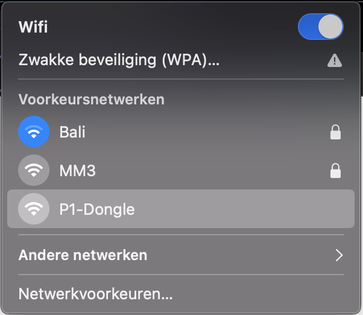
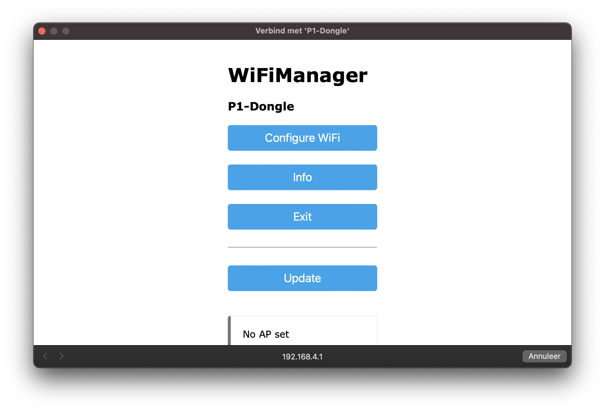
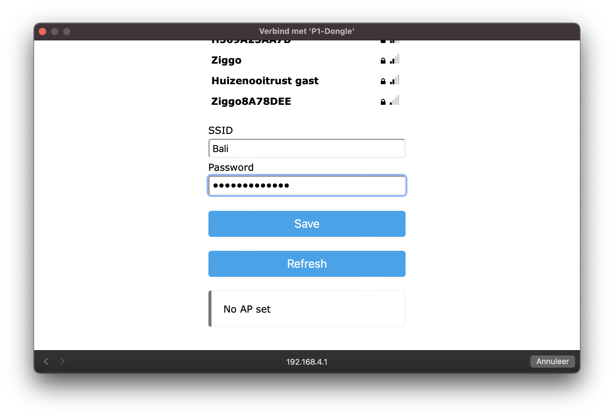
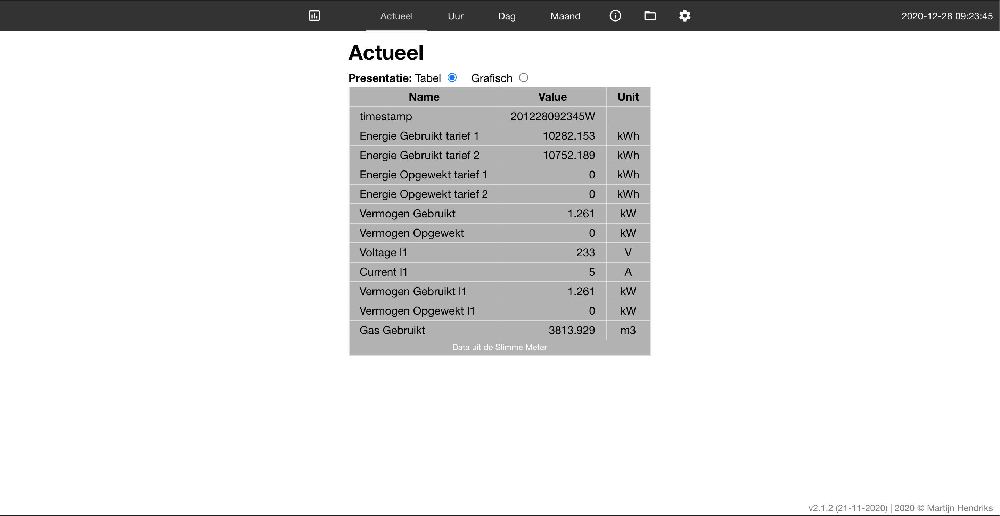
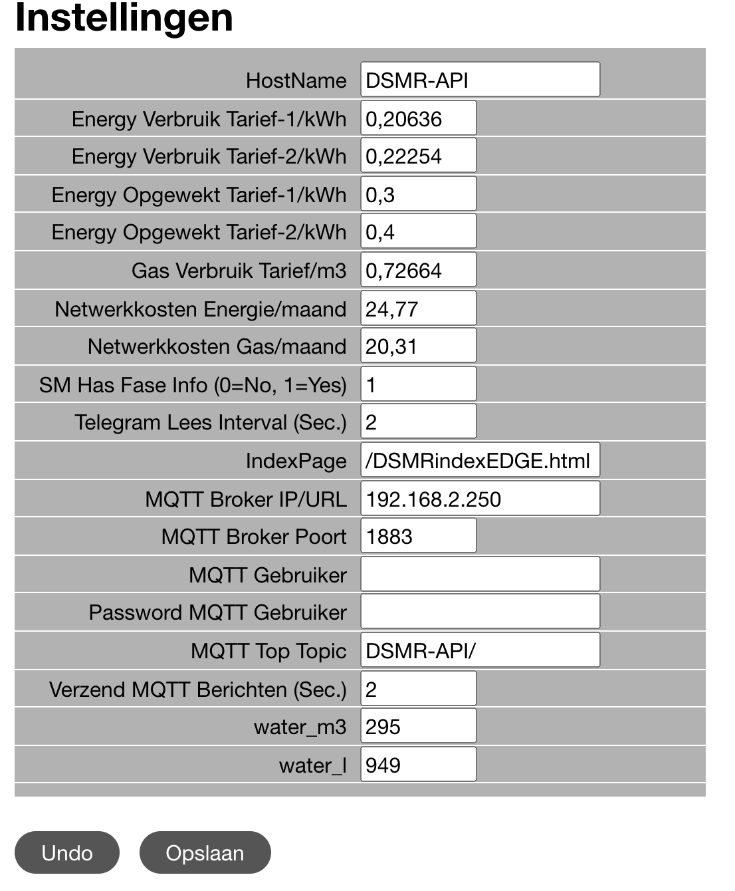
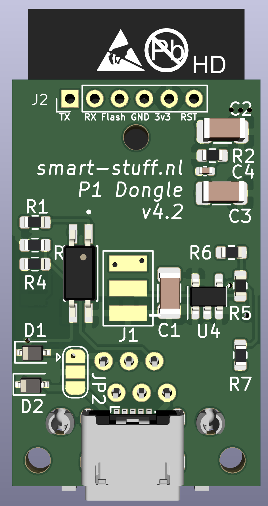

# **P1 + Waterlezer dongel (ESP32)**

Dit document beschrijft de installatie en configuratie van de Watermeter Dongel op ESP32 hardware. De hardware komt met werkende software. De Dongel dient te worden aangesloten op de slimme meter en watermeter. Wil je deze aanpassen ga dan naar het onderdeel Flashen.<br>

## **LED functie**<br>
De dongel is uitgerust met een blauwe LED. Deze heeft meerdere functies, namelijk:
- na inpluggen zal de LED ca 1.5 seconde oplichten. Is dit niet het geval dan is er een probleem met stroom of met de dongel
- Zodra de dongel WiFi connectie heeft zal de LED blijven branden.
- Tijdens het lezen van een datapakket zal de LED kortstondig uit of aan gaan. Indien er Wifi verbinding is gaat de LED kort uit. Indien er geen Wifi is zal de LED kort aan gaan.

## **USB voeding**<br>
USB adapter bij een P1 + Waterlezer dongle is noodzakelijk. In combinatie met de slimme meter zal het soms mogelijk zijn om de 5.0  slimme meter de dongel te laten voeden. <br>
>**TIP**<br>
>De USB adapter mag een oude smartphone of tablet adapter zijn of een usb aansluiting die voorhanden is in de meterkast (bv van een NAS/Router). Bijna alle voedingen voldoen (5V/5Watt is prima).<br>

## **Monteer de sensor op de watermeter**<br> 
Watermeters met een metalen plaatje op de kleine wijzer zijn geschikt voor deze set. Het is zaak om de sensor recht boven deze wijzer te plaatsen zonder dat er lucht/plakband tussen de sensor en de wijzer zit. Afstand tussen wieltje en sensor dient zo klein mogelijk te zijn voor de meest accurate opname.<br>
<br>
Ook dient de sensor zo te zitten dat deze 1 keer per omwenteling een signaal opneemt. Dit kan je aan de sensor zien doordat het rode lampje gaat branden. Sensor zit normaal gesproken recht boven deze wijzer maar dan iets verschoven van het midden van deze wijzer.
Maak de sensor vast met meegeleverde klittenband of met de sensor houder, zie onderstaande montage wijze.


>**TIP**<br>
>- Zet de kraan een beetje open om te checken of de sensor goed zit (rode ledje gaat dan per omwenteling 1x aan).<br>
>- Monteer de sensor met het kruis / rode ledje naar de wijzerplaat toe.

**Configuratie dongle**<br>
Onderstaande stappen dienen gevolgd te worden.<br>
- sluit usb adapter aan via een usb micro kabel
- de LED van de dongle licht op en de dongle start op
- wacht 20 seconden en zoek op PC/laptop/smartphone/tablet naar wifi hotspot (p1-dongle) en klik deze aan


- Verbind met de hotspot



- Klik op &quot;Configuratie Wifi&quot;



- Klik op het uw netwerknaam en vul daarna het bijbehorende en **wachtwoord** in bij Password.
- Druk op &quot;Save&quot;
- Adapter zal op nieuwe opstarten en u kunt het scherm sluiten.

Vanaf dit moment zal de adapter te vinden zijn via: [http://p1-dongle.local/](http://p1-dongle.local/) 

Deze naam is aanpasbaar via settings in de dongle.

##**Aansluiten Sensor**<br>

## **Uitlezen Slimmemeter**<br>
Er zijn drie manieren om via de dongel de slimmemeter uit te lezen, namelijk:

1. Via de webinterface van de Slimme meter ([http://p1-dongle.local/](http://p1-dongle.local/))
2. Via de rest api ([http://p1-dongle.local/api/v2/hist/hours](http://p1-dongle.local/api/v2/hist/hours)); zelf ophalen van de gegevens op gewenste moment; zie API info in de webinterface voor meer informatie
3. Via MQTT; dongel pusht elke x seconde de gegevens naar de mqtt broker; zie hieronder de configuratie van mqtt

## **Webinterface**<br>
Het hoofdscherm opent met onderstaande pagina. Kan zijn dat de tabel nog leeg is in de eerste 30 seconden na opstarten.



In de menu zijn de volgende opties opgenomen

1. Actueel: samenvatting van de verschillende grootheden
2. Per Uur / Per Dag / Per Maand: de verbruikscijfers weergegeven per dag/maand/jaar
3. Telegram: ruwe data uit de slimme meter
4. All Fields: alle slimme meter data netjes geformateerd
5. Systeem info: informatie over de adapter zoals versie, capaciteit
6. APIDocs: informatie over de mogelijkheid om de gegevens op afstand te kunnen uitlezen
7. File symbool: kunnen de bestanden op de adapter geraadpleegd/verwijderd of geupload worden
8. Wieltje: systeeminstellingen.

## **Configuratie**<br>
Open in de browser [http://dsmr-api.local/](http://dsmr-api.local/)
Druk op het wieltje rechts in het menu. Het onderstaande settingsscherm is zichtbaar.
Vul onderaan de beginstand van de watermeter in en druk op Opslaan. 

>**LET OP**<br>
> Meters met 2 rode cijfers dienen ingevoerd te worden met een 0 achter de laatste cijfer. Dus 34.23 wordt ingevoerd als 34 m3 + 230 liter



## **Watermeters met 10 liter wieltje!**<br>
Heeft u een watermeter met een wieltje wat 10liter per omwenteling registreert dan dient de settingsfile van de dongle aangepast te worden. Volg de onderstaande stappen.
1. open http://p1-dongle.local/#FileExplorer in uw browser
2. download de DSMRsettings.json file
3. pas ```"waterfactor":1``` aan naar ```"waterfactor":10```
4. upload de aangepaste settingsfile en start de dongle opnieuw op

1 - MQTT

Voor het activeren van de mqtt interface dient het onderstaande ingesteld te worden.

1. HostName (mqtt broker)
2. MQTT Broker IP/URL: (bv: 192.168.2.250)
3. Port (default: 1883)
4. MQTT Top Topic van deze adapter (default: DSMR-API)
5. Optioneel: wachtwoord en Username
6. Verzenden MQTT berichten: in welke frequentie de berichten verzonden worden. In dit voorbeeld elke 2 seconden terwijl de leesfrequentie 10 seconden is. Beetje onzinnig de huidige instelling ;-) aangezien er dan 5 x dezelfde waarde verzonden wordt.
7. Op Opslaan drukken rechtsboven om de settings op te slaan en mqtt te activeren

2 – Tarieven

In hetzelfde settingsscherm zijn ook de tarieven in te vullen zodat bij de kostenberekening de bedragen komen te staan. Pas deze aan op basis van je contract met je energie leverancier.

Let op! de bedragen in de adapter kunnen afwijken van je echte nota en zijn daarom indicatief

3 - watermeter 
In de laatste 2 velden kan de watermeter stand ingevuld worden of worden geupdate.

4 – Overige instellingen

De frequentie van uitlezen kan ingesteld worden.

Daarnaast ook de frequentie van toesturen van de MQTT gegevens.

## **Remote update**<br>
Dit kan op twee manieren, namelijk
1) via Telnet door U + <return> in te typen en daar na versie nummer (bv 4.2.3) + <return>. Vanaf 4.2.0 versie is de watermeterfunctie standaard aanwezig in de firmware.
2) via de webinterface door de functie aanroep + versie op te geven. Bijvoorbeeld: /remote-update?version=4.2.3

Ook Filesysteem update is mogelijk via telnet. Dit door S <return> versie <return> in te voeren. 
Standaard zal er geupdate worden van de ota.smart-stuff.nl directory. Deze verwijzing kan worden aangepast in de settingsfile op de dongel. 

>Let op: er kan alleen verwezen worden naar http servers.

## **Flashen**<br>
Flashen dient via een USB - TTL adapter te gebeuren. Op J2 (onderkant) zitten de aansluitingen voor deze interface. 



1. RX
2. TX
3. Flash
4. GND
5. 3.3Volt
6. Reset

De software is te vinden op [https://github.com/mhendriks/P1-Dongel-ESP32/releases](https://github.com/mhendriks/P1-Dongel-ESP32/releases)

>**LET OP!<br>
>Dongle altijd loskoppelen van voeding / slimme meter wanneer deze wordt geflasht**

**Meest voorkomende problemen**<br>
*Hotspot (P1-Dongel) niet of kort zichtbaar</br>*
De basic dongel wordt gevoed door de slimme meter. Afhankelijk van het merk / type is de stroomlevering kritischer. 
De dongel zal bij de eerste aanmelding de omgeving scannen en zijn netwerk instellen. Dit kost kortstondig veel stroom en enkele meters zullen dit niet accepteren en de voeding stoppen. Gevolg is dat de dongel steeds op nieuw gaat starten (LEDje knippert).
Neem in z'n geval contact met mij op om de dongel te ruilen voor een exemplaar met extra usb aansluiting. Vaak is het alleen nodig om de usb voeding tijdens de eerste start aan te sluiten. Daarna kan deze verwijderd worden. Let op! valt de stroom uit dan kan het nodig zijn om de usb voeding weer te gebruiken. 