# **ESPHome installatie**

Als de P1 Dongle voorzien is van ESPHome firmware is de integratie met Home Assistant zeer eenvoudig.
Hieronder de stap voor stap integratie met Home Assistant.

>**USB voeding**<br>
>Voor slimme meters versie 2.x, 3.x en 4.x is een extra usb adapter nodig die de P1 dongle van stroom voorziet. 
>De USB adapter mag een oude smartphone of tablet adapter zijn of een usb aansluiting die voorhanden is in de meterkast (bv van een NAS/Router). Bijna alle voedingen voldoen (5V/5Watt is prima).

**ESPHOME pre-installed**<br>
In deze optie is de dongle uitgerust met ESPHome.
Stappen om deze zelf te voorzien van de juiste configuratie volgt hieronder.
1) Sluit de p1-dongle aan op de slimme meter
2) Koppel de dongle aan uw Wifi netwerk
3) Configureer de dongle in Home Assistant
 
**1. Dongle aansluiten**<br> 
Sluit de dongle aan op de p1 uitgang van de slimme meter en op de eventuele benodigde (versie 2/3/4 slimme meters) usb adapter.</br>
 
**2. Koppel Dongle aan uw Wifi netwerk**<br>
Na aansluiten (stap 1) bouwt de dongle als eerste een eigen Wifi hotspot op ten behoeve van configuratie. Deze hotspot is te herkennen door de Wifinaam **p1-dongle**.

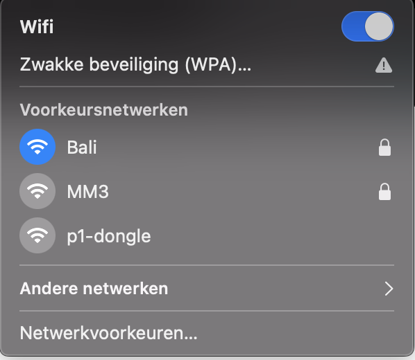

Zorg dat je met je computer of mobiel toestel contact maakt met dit netwerk, door hier op te klikken. Automatisch wordt een scherm getoond waarin de WifiManager te zien is. Zie onderstaande plaatje.

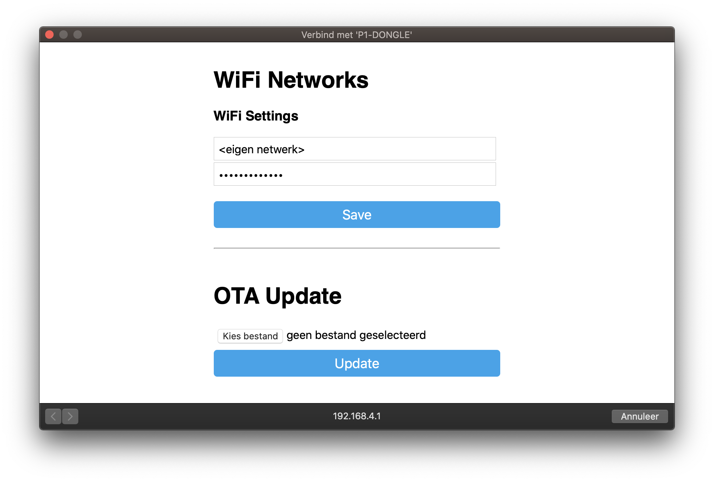

Ook het tonen van deze popup kost tijd. Is deze er na 30 seconden nog niet dan kunt u zelf naar dit scherm te gaan door deze url te openen in uw browser: [http://192.168.4.1](http://192.168.4.1)

>**Wifihotspot blijft komen**</br>
>5.0 meters zouden voldoende stroom moeten leveren om de dongle te voeden. Toch komt het af en toe voor dat er te weinig stroom geleverd kan worden. De dongle blijft maar komen met de netwerk installatie procedure. Advies is om dan een usb adapter aan te sluiten op de usb ingang.


1. Vul bij SSID uw netwerknaam in en bij Password uw netwerkwachtwoord
2. Druk op &quot;Save&quot;
3. De dongle zal op nieuwe opstarten en u kunt het scherm sluiten en de computer verbinden met uw thuis netwerk.

Vanaf dit moment zal de dongle te vinden zijn via: [http://p1-dongle.local/](http://p1-dongle.local/), [http://p1-dongle-pro.local/](http://p1-dongle-pro.local/)  of via het ip-adres van de dongle.

>**TIP**<br>
>mocht de dongle niet te bereiken zijn haal dan de dongel even 5 seconden uit de slimme meter/ ontkoppel de usb adapter. Bij het opnieuw starten zal de dongle zich weer kenbaar maken.
>de p1 dongle pro is te bereiken op http://p1-dongle-pro.local (uitlevering vanaf 22/5/22) 

**3. Configureer de dongle in Home Assistant**<br>
Zodra de dongle verbonden is met uw netwerk zal deze in de auto discover modus zichtbaar zijn in Home Assistant.

3.1. Automatisch zichtbaar<br>
Voer onderstaande stappen uit in Home Assistant Instellingen > Apparaten & Diensten.<br>
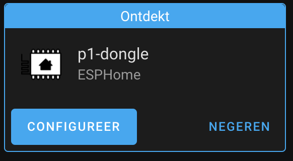<br>
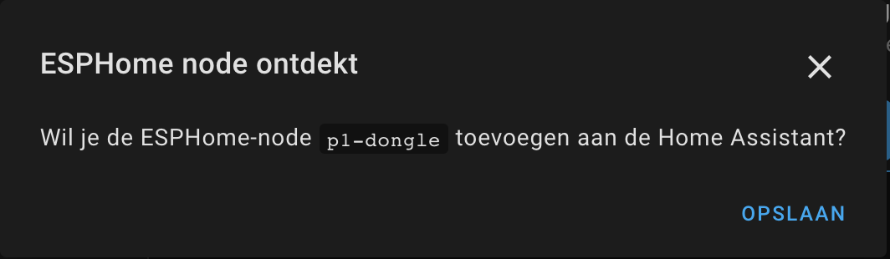<br>
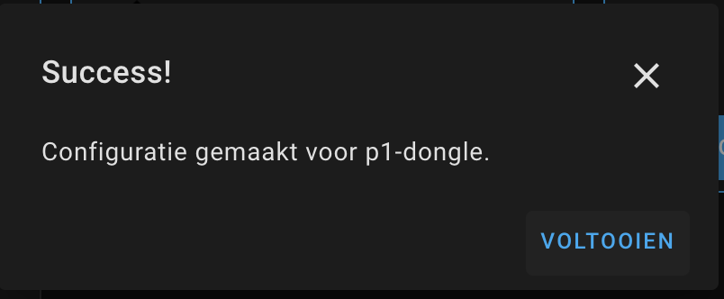<br>
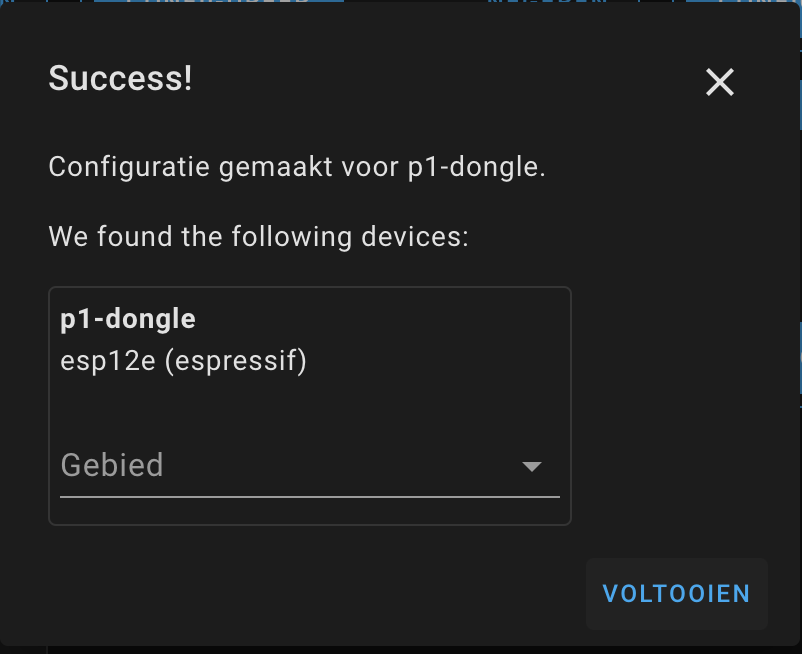<br>
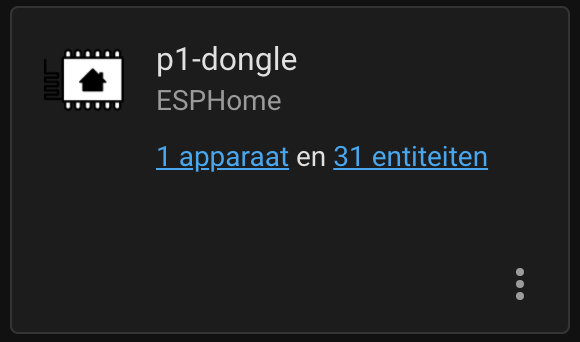<br>
<br>
3.2. Handmatig toevoegen</br>
Zodra deze niet zichtbaar is kan deze met de hand toegevoegd worden in Instellingen > Apparaten & Diensten (Add Integration > ESPHome).
Indien de ESPHome nog niet bestaat in de integratie pagina dient deze toegevoegd te worden door rechtsonder op de + te drukken en te zoeken naar ESPHome
Voer onderstaande stappen uit.<br>
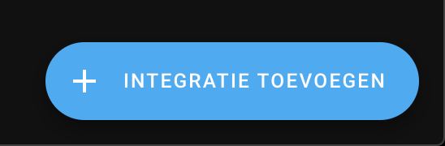<br>
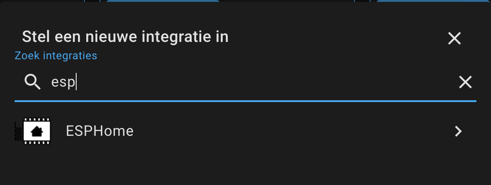<br>
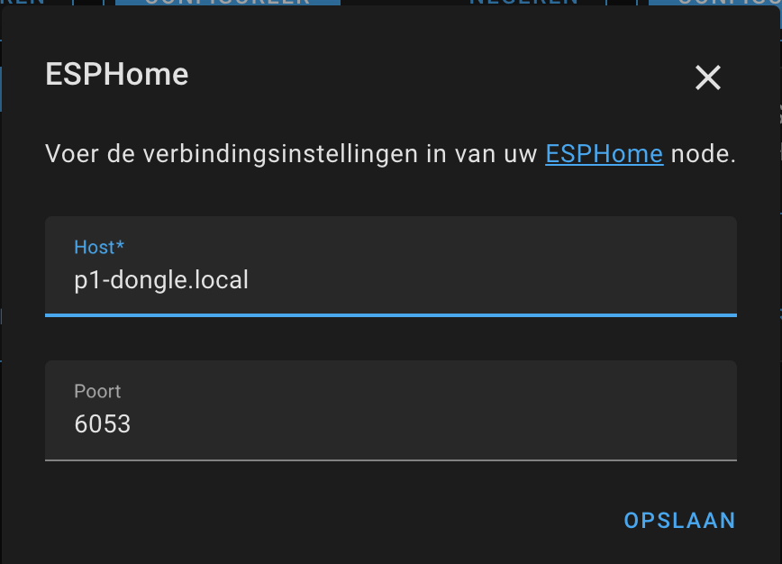<br>
<br>
<br>
<br>

>**TIP**<br>
>mocht p1-dongle.local niet werken haal dan de dongel even 5 seconden uit de slimme meter of koppel de usb adapter los. Bij het opnieuw starten zal de dongle zich weer kenbaar maken.

**4. EXTRA ESPhome Dashboard**</br>
Beheer van de module via het ESPhome dashboard. 
Hieronder is de module te zien.<br>
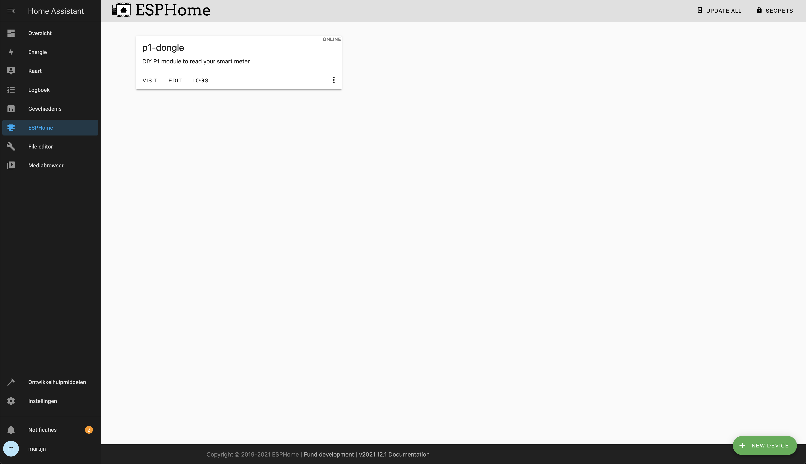<br>

Indien deze niet zichtbaar is kan deze toegevoegd worden door op [+ NEW DEVICE] knop te klikken rechtsonder aan. Volg dan de stappen hieronder.<br>
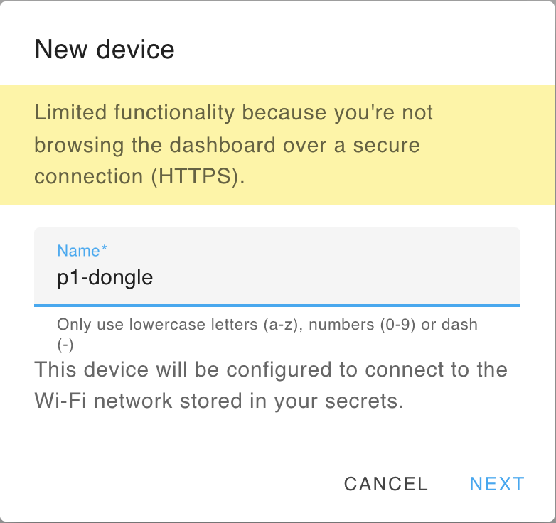<br>
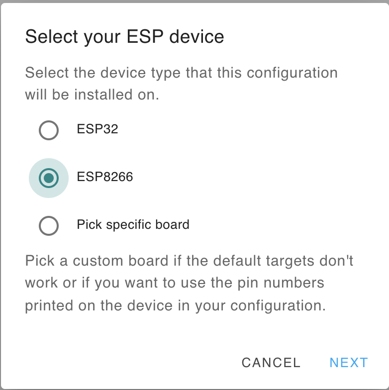<br>

Zelf de configuratie aanpassen kan eenvoudig zie "Zelf aanpassingen maken in de configuratie".
<br>
# **Eindresultaat**<br>
Daarna kan in Energie en in de Home pagina de rest van de configuratie gemaakt worden. Bijvoorbeeld zoals hieronder.


# **DSMR 2.2 slimme meters**<br>
Voor een 2.2 versie van de slimme meter is een andere yaml configuratie. Deze is te vinden op [p1-dongle-dsmr2.2.yaml](p1-dongle-dsmr2.2.yaml).
Indien u ook een gasmeter heeft dit met de slimme meter communiceert dan dient ook de Home Assistant configuratie aangepast te worden om de gasgegevens te kunnen inzien.<br>
<br>
Voeg het onderstaande toe aan uw HA config.yaml<br>

```
template:
  - sensor:
      - name: "Gas Meter"
        unique_id: gas_meter
        state_class: total_increasing
        device_class: gas
        unit_of_measurement: 'm³'
        state: '{{ states("sensor.gas_delivered_raw") | regex_findall_index("\d{3,5}\.\d*") | float }}'

```

# **Zelf aanpassingen maken in de configuratie**<br>
In de ESPHome dashboard waarin u zelf de diverse modules kunt beheren kunt u de p1-dongle zien, toevoegen en bewerken.
Onder Edit kan de configuratie worden aangepast. In het bestand [p1-dongle.yaml](p1-dongle.yaml) kunt u de standaard configuratie zien.

# **Flashen**<br>
Flashen dient via een FTDI interface te gebeuren (115200 baud). Op J2 (onderkant) zitten de aansluitingen voor deze interface. 
De pinout (v3.3 hardware) is :

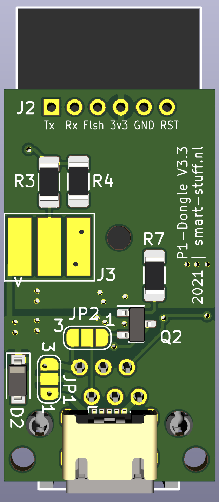

1. RX
2. TX
3. Flash (vierkante pad / Rode pijl); Flash naar GND en opnieuw opstarten om in de program mode te komen
4. 3.3Volt
5. GND
6. Reset = GND


# **FAQ | Meest voorkomende problemen**<br>
*Hotspot (P1-Dongle) niet of kort zichtbaar</br>*
De basic dongle wordt gevoed door de slimme meter. Afhankelijk van het merk / type is de stroomlevering kritischer. 
De dongle zal bij de eerste aanmelding de omgeving scannen en zijn netwerk instellen. Dit kost kortstondig veel stroom en enkele meters zullen dit niet accepteren en de voeding stoppen. Gevolg is dat de dongle steeds op nieuw gaat starten (LEDje knippert).
Neem in z'n geval contact met mij op om de dongle te ruilen voor een exemplaar met extra usb aansluiting. Vaak is het alleen nodig om de usb voeding tijdens de eerste start aan te sluiten. Daarna kan deze verwijderd worden. Let op! valt de stroom uit dan kan het nodig zijn om de usb voeding weer te gebruiken. 
