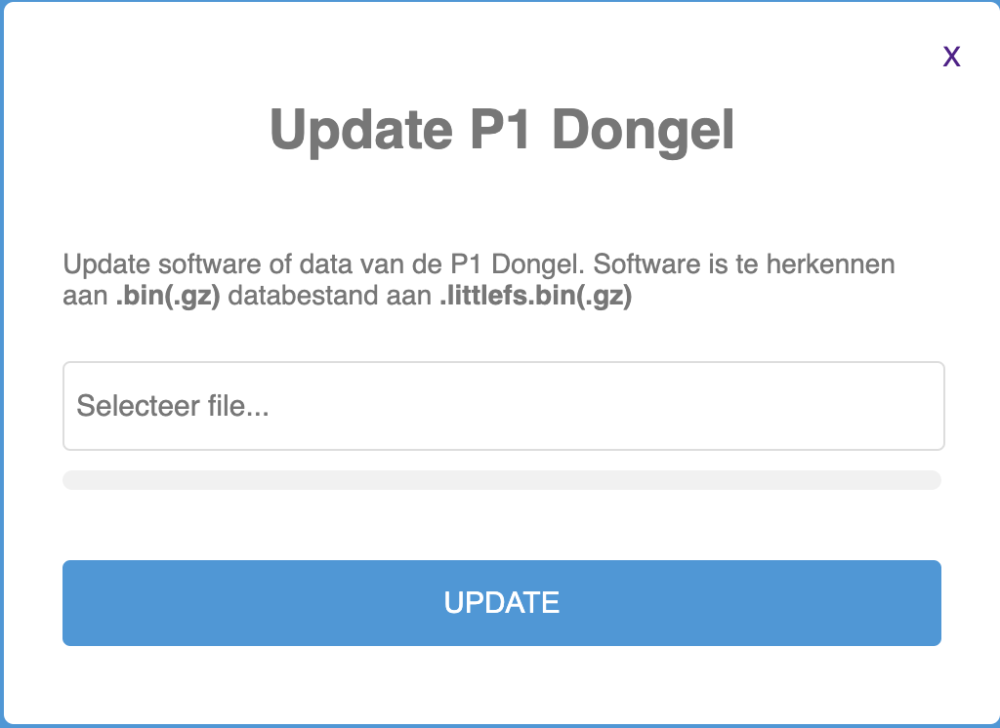
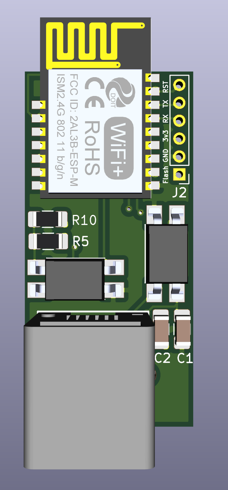

# **Software updates**
De Dongle kan op verschillende manieren van nieuwe firmware/data voorzien worden. Meest gebruikelijke manieren zijn:
1. Over The Air (OTA) update via de webinterface
2. Flashen via een FTDI adapter

Advies is om allereerst een OTA update te proberen. Mocht dit niet lukken of mislukken dan zou daarna een update via de FTDI adapter uitgevoerd kunnen worden.

**OTA update**
De update pagina van de webinterface is in de firmware aanwezig zodat deze altijd aangeroepen kan worden indien de module opstart. Het aanroepen van de gaat via deze  url: http://dsmr-api.local/update

Er wordt dat een update pagina getoond, zie hieronder. Is dit niet het geval, update dan de module via de FTDI adapter methode.



Er kunnen twee soorten updates uitgevoerd worden, namelijk:
1. file systeem: opnieuw alle bestanden op de dongle zetten. herkenbaar aan bestandsnaam .spiffs.bin(.gz) of vanaf de 3.0.0 versie -> .littlefs.bin(.gz)
2. firmware: opnieuw/update van de software. herkenbaar aan bestandsnaam .bin(.gz)

Vanaf de 3.0.0 versie kan een van de bestanden geupload worden en de module herkent zelf welk type dit is. Voor de 2.x.x versie dient firmware en file system bestanden via de beschikbare opties in het upload scherm worden aangeboden.
Na het klikken op UPDATE wordt het bestand geupload, de software geinstalleerd en volgt er een reboot. Dit proces kan enkele minuten duren.

**Flashen via FTDI adapter**

Flashen dient via een FTDI interface te gebeuren (115200 baud). Op J2 zitten de aansluitingen voor deze interface. 
De pinout is :



1. Flash (vierkante pad / Rode pijl); Flash op GND en opnieuw opstarten om in de program mode te komen
2. GND
3. 3.3Volt
4. RX
5. TX
6. Reset (indien deze tegen GND aangehouden wordt zal de module resetten)

De firmware/file system bestanden zijn te vinden op [https://github.com/mhendriks/DSMR-API-V2](https://github.com/mhendriks/DSMR-API-V2)

**LETOP!!! afhankelijk van je hardware zijn er modules met 1,2 of 4Mb geheugen. Het is belangrijk om de juiste bestanden/instellingen te gebruiken bij het updaten van de software. Op de Systeeminformatie pagina staat bij Real Chip Size de geheugenomvang.**


Hardware in download modus zetten. Dit doe je zo:
1. Flash poort aan GND koppelen
2. Daarna de RESET poort aan GND koppelen en na 1 seconden weer losmaken (Flash blijft nog op GND)
3. na upload van de firmware Flash losmaken en module Resetten via Reset. 

Bij elke update stappen 1 tot 3 doorlopen.

Voor het flashen kan de Arduino IDE gebruikt worden echter dit kost behoorlijk wat setup inspanning. Eenvoudiger is om de Esptool te gebruiken.

Voorbeeld 2Mb versie flashen ***file system***.
- MacOS voorbeeld
- gebruik python3
- upload script van de Arduino 
- let op! poort zelf even juist instellen
- write_flash 0x1F0000 = 2Mb, 0xEB000 = 1Mb
- bijvoorkeur de .gz versies gebruiken omdat daar de upload sneller bij gaat (kans kleiner op een verstoring)

```
python3 ~/Library/Arduino15/packages/esp8266/hardware/esp8266/2.7.4/tools/upload.py --chip esp8266 --port /dev/cu.usbserial-A50285BI --baud 115200 --before default_reset --after hard_reset write_flash 0x1F0000 DSMR-API-V2.3_2Mb.spiffs.bin.gz
```

Voorbeeld flashen ***firmware*** (geheugenomvang is hierbij niet belangrijk voor de upload tool)
```
python3 ~/Library/Arduino15/packages/esp8266/hardware/esp8266/2.7.4/tools/upload.py --chip esp8266 --port /dev/cu.usbserial-A50285BI --baud 115200 --before default_reset --after hard_reset write_flash 0x0 DSMR-API-V2.3.6_2Mb.bin.gz
```